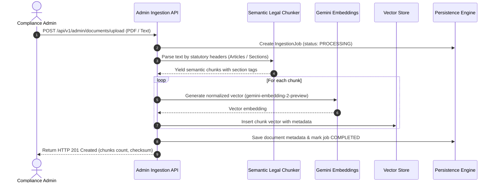
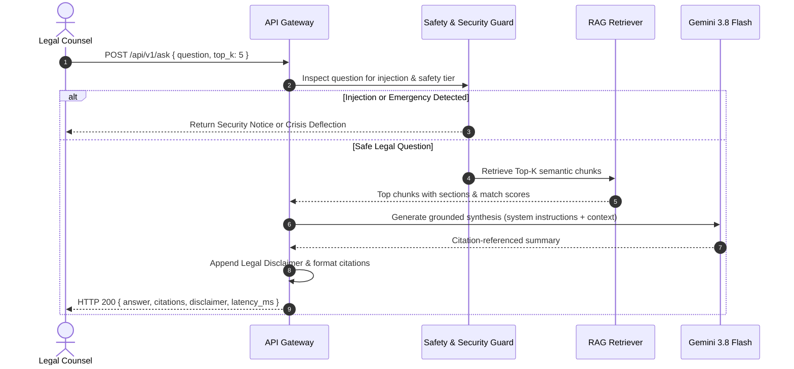

# LexiRAG System Architecture & Design Documentation

## 1. Executive Summary
LexiRAG is an enterprise-grade Legal Document Retrieval-Augmented Generation (RAG) platform designed to deliver verified, citation-backed legal analysis while eliminating hallucinations and preventing unauthorized practice of law (UPL) liability.

```mermaid
graph TD
    Client[React + Tailwind Single Page App] -->|HTTPS / REST API| Ingress[Express API Gateway :3000]
    
    subgraph Security & Policy Layer
        Ingress --> Auth[JWT & RBAC Middleware]
        Auth --> RateLimit[Token Bucket Rate Limiter]
        RateLimit --> Sanitizer[Input Sanitizer & Injection Guard]
        Sanitizer --> Safety[Legal Safety & Emergency Classifier]
    end
    
    subgraph RAG Orchestrator
        Safety -->|Pass| QueryEmb[Gemini Embedding Service]
        QueryEmb --> VectorSearch[Vector Index Store]
        VectorSearch -->|Top-K Chunks + Metadata| ContextBuilder[Strict Citation Prompt Builder]
        ContextBuilder --> GeminiLLM[Gemini 3.8 Flash Grounded Generation]
    end

    subgraph Data & Persistence
        VectorSearch <--> VectorStore[(In-Memory / PgVector Index)]
        Ingress <--> DB[(Atomic JSON / PostgreSQL DB)]
    end

    subgraph Admin Ingestion Pipeline
        Ingress --> AdminRouter[/api/v1/admin/*]
        AdminRouter --> Chunker[Semantic Legal Chunker]
        Chunker --> DocEmb[Batch Gemini Embedder]
        DocEmb --> VectorStore
        DocEmb --> DB
    end

    GeminiLLM --> Formatter[Citation Formatter & Legal Disclaimer Append]
    Formatter --> Client
```

---

## 2. Ingestion Pipeline & Semantic Legal Chunking

Unlike conventional text chunkers that blindly split tokens at fixed intervals, LexiRAG employs a **Legal Syntax Chunker**:
1. Detects statutory boundaries (`Article X`, `Section § X-XXX`, `Chapter`, `Title`).
2. Preserves statutory titles and hierarchies inside chunk headers for maximum semantic retrieval density.
3. Generates checksum hashes (`SHA-256`) to guarantee idempotency and provenance.



---

## 3. Query Execution & Grounded Retrieval Flow

Every user inquiry undergoes multi-tier security inspection before vector retrieval occurs:
1. **Prompt Injection & Jailbreak Defense**: Detects `<system>`, `ignore previous instructions`, instruction overrides.
2. **Emergency Query Deflection**: Detects urgent threats to life or emergencies and routes to crisis hotlines immediately without invoking LLM.
3. **Personalized Advice Guard**: Classifies whether a user is asking for formal legal representation or legal outcomes and prepends explicit non-attorney advisory.
4. **Vector Retrieval**: Computes query cosine similarity against indexed chunks.
5. **LLM Synthesis**: Directs Gemini with a system prompt requiring that all claims reference retrieved citations `[1]`, `[2]`.



---

## 4. Role-Based Access Control (RBAC)

The system enforces strict permission boundaries:
- **Anonymous**: Can ask general legal questions and verify citations.
- **USER (Legal Counsel)**: Can save conversation histories, review past queries, submit feedback on citations.
- **ADMIN (Compliance Officer)**: Can upload legal documents, trigger background vector re-indexing, inspect audit logs, and view system observability metrics.
